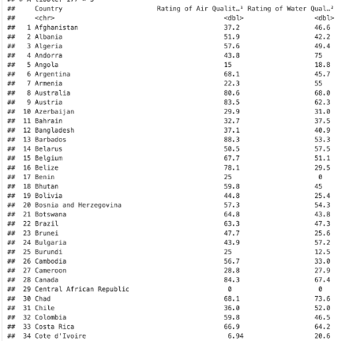

```
Introduction: 

Pollution globally is a leading contributor for affecting all generations with regards to how we 
live our lives daily. From gas pollution to the growing manufacturing and modernization of countries
contributing to increasing levels of pollution. We were curious as to which countries have higher 
pollution ratings compared to others and if salary of a country would be a contributor to higher 
pollution for a particular country. Growing up, we would read articles about the alarming rates of 
increasing pollution affecting everyone globally and the negative impacts to our world. From the 
increase in wildfires, potential extinction of wildlife, and rising sea levels that could lead
to risk to humans. Given this information from media, we wanted to take a deeper dive using data 
science on which countries may play a bigger factor in increasing pollution levels globally and 
draw potential solutions using data driven predictions. Given that pollution contributions are so broad, 
we decide to look globally at water and air pollution and how they affect our world while analyzing the 
salary of a particular country. Before analyzing our dataset, we wanted to answer three research questions
given our datasets. 
1) How does the level of pollution vary in regions with different levels of income? Can income 
predict pollution for a given area?
2) Do air pollution and water pollution always overlap? Is air pollution a good predictor of water 
pollution and vice versa?
3) Do bordering countries always have similar or identical air qualities?  If not, is a 
difference in individual national environmental policies to blame for air quality difference?
Given our research questions, we are motivated in finding answers as to what may be the reason why 
certain countries higher water and air pollution have compared to others. We think that salary and 
overall GDP could play a factor into how globally pollution is correlated. We want to tell a 
story of the alarming global emissions and how society can help the earth with protecting mother 
nature with potentially how changes can happen today. We want to use data science to raise awareness 
of the global rates of pollutions with hopes of motivating action for all generations as pollution 
affects everyone, regardless of social class. Although we are discovering new details of water and 
air pollution, we hope to discover new findings we never thought of. We believe countries with 
less salary would generally lead to lower pollution but is this true for every case globally? 
Is there anything happening politically that could drive pollution to higher levels compared to 
countries without political problems? We find this is important for everyone as the target audience 
applies to everyone. The target audience of this project are individuals or organizations concerned 
about the environmental pollution in different regions. Specifically, people who are interested in 
learning about the pollution disparity between different countries and regions can look to the findings
of this project for information. For example, regional organizations focused on improving and advocating
for more sustainability measures could use this information to support their cause, such as placing 
attainable goals based on comparing with data from similar regions. 

```


```
Conclusions: 
Based on our results, we can see a correlation of water and air pollution vs. the annual salary of a 
country. For example, the air quality pollution graph shows from 0-100 with poor quality highlighted
as red and becomes lighter to yellow with best air quality. We can see based on our data that first 
world countries have better air quality. In The United States for example we see a light-yellow color 
showing a better air quality compared to countries such as China having a red color. China having a 
red color show that their air quality over time is worse compared to the United States. We see this 
trend also when analyzing other countries such as India, Mali, and Russia being second and third-world
countries. Moving to water quality pollution, we used a similar methodology with our air pollution by 
looking at our data set and manipulating the columns. We saw that there was so much data for each 
country for water and air pollution, that we decided to create a water score where we take 100 – the 
water score to get its predicted score of water pollution. This way, we can see by the predicted air
and water pollution to plot globally. The data shows us that air pollution is like water pollution 
with generally, first world countries have less air and water pollution when compared to second and 
third world countries. This correlates also when looking at salary data of each country with first 
world countries having higher salaries compared to Russia for example. Using our methodology with 
data filtering and manipulation, we see our initial thoughts of salary playing a part of pollution 
globally. When looking at our other graphs, we decided to not use map plotting and instead use the 
large dataset given to us to see if there was a trend line between our pollution vs. salary data.
The methodology for creating these plots that are not map plots was grouping by columns and analyzing
by using ggplot with some plots being scatter and line plots. We see the graphs showing similar trends
with the pollution rates from our map data with first world countries (having higher median salary) 
contributing to our results of pollution. When we look at statistics such as Afghanistan having lower
median salary and higher pollution compared to the United States shows that our data is proving initial 
thoughts of higher median salary having lower emissions.

```


```
Findings:
Looking at the meaning of our results from the dataset, we see similar trends developing with 
relations of pollution vs. salary of each country. Looking at our dataset, we see on our trend
line comparing median salary and air quality, we see there is an influx of or result where the 
median salary from 0-2500 (USD currency) for a particular country resulted in a higher density
of air pollution. Many of the points were towards the bottom with the median being at the middle 
(25-75 percent pollution) but see that the increasing median salary resulting in better air
quality. This similar trend for average salary shows that pollution is associated with the salary
data from our dataset. Reflecting back to our research questions, we see that some of our questions
are answered. For the first research question, we see that predictions of salary being associated 
with pollution is a good baseline to see how a country is doing. We see in our trend lines and in 
our data that countries that are considered third world compared to first world countries have a 
huge differentiation with levels of pollution and average salary. Secondly, water and air pollution
have similar trend lines with some data overlapping with each other. This is not always correct, 
but we see a correlation between the water and air pollution proportion to the country’s salary. 
Looking at the last plot, we see that our data is very scattered and messy. With messy data when
you try to plot so much data together. Comparing air pollution as the x and water as y coordinate,
we see it is hard to analyze the data given how many plots we have. Lastly, we see for the last
research question that we cannot accurately predict or say that neighboring countries have similar 
pollution levels. For example, we see that Brazil has a yellow air quality meaning that the overall
air pollution levels are low resulting in higher air quality. Looking at its neighbors, we see that
Venezuela has significantly higher levels of pollution. These statistics and plotting globally makes
our last research question not possible to predict because it is dependent on the country’s pollution
levels, not on neighboring countries' air pollution levels. We do see salary correlating with pollution
levels which proves the other research questions. For directions for future gathering of our work, 
we hope that there will be more datasets we can group together and analyze such as other forms of 
pollution and see if salary plays an important factor in determining the overall pollution levels. 
Pollution is an important concept that requires many different forms of data in order for us to find
solutions that drive innovation.
```

```
Takeaway:
In conclusion, global pollution is an important issue that affects all people. Pollution such as 
air and quality affects everyone regardless of race, ethnicity, gender, and generation. We need
to raise more awareness of the ongoing implications of this global health crisis as we eventually 
will be at a point where our actions are irreversible. This starts with taking small steps towards
reducing our footprint. From taking small steps such as recycling, to reusing our water bottles to
reduce global pollution. We hoped after reading our dataset, looking at our graphs, and hearing our
findings, you would become more educated in this topic such as pollution levels globally. We can see
that there is a correlation with higher median salary per country is associated with lower pollution
levels. Although this is true, we acknowledge that simply looking at median salary is not enough to 
claim, “higher salary means less pollution for every case”. This is simply not true. We can see based
on our data set; we see a relationship. Though, we must gather more datasets to find a better understanding 
of how to better tackle this issue. We also acknowledge that there is a key contributor to pollution that 
is not talked about or could be analyzed by using data science. This being the physical and emotional health 
of individuals globally. Having read the articles mentioning exploitation of worker rights while trying to mine
lithium in Africa, to current political environments such as wars. We cannot assume that the United States is 
the best in the world for pollution. In those articles, there are workers being worked for pennies an hour, 
creating immense air pollution which results in many countries within Africa to have alarming rates of pollution.
We must talk about the political environment happening now and the past that leads to our results. Lastly, 
we hoped you took away the importance of analyzing trends in our current topic with pollution and how salary 
may play a role in pollution globally. From looking at the global salary dataset and seeing the increase in 
salary not being proportional to other countries reflected through the plot charts, to the concurrent increasing
pollution levels post industrial revolution. Hopefully today we can all start together to combat pollution for a better life for everyone.

```

