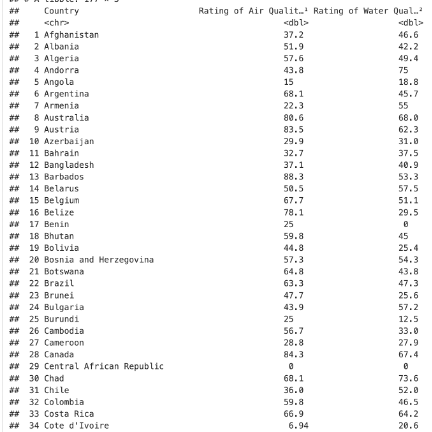

```
Introduction: 

Pollution globally is a leading contributor for affecting all generations with regards to how we 
live our lives daily. From gas pollution to the growing manufacturing and modernization of countries
contributing to increasing levels of pollution. We were curious as to which countries have higher 
pollution ratings compared to others and if salary of a country would be a contributor to higher 
pollution for a particular country. Growing up, we would read articles about the alarming rates of 
increasing pollution affecting everyone globally and the negative impacts to our world. From the 
increase in wildfires, potential extinction of wildlife, and rising sea levels that could lead
to risk to humans. Given this information from media, we wanted to take a deeper dive using data 
science on which countries may play a bigger factor in increasing pollution levels globally and 
draw potential solutions using data driven predictions. Given that pollution contributions are so broad, 
we decide to look globally at water and air pollution and how they affect our world while analyzing the 
salary of a particular country. Before analyzing our dataset, we wanted to answer three research questions
given our datasets. 
1) How does the level of pollution vary in regions with different levels of income? Can income 
predict pollution for a given area?
2) Do air pollution and water pollution always overlap? Is air pollution a good predictor of water 
pollution and vice versa?
3) Do bordering countries always have similar or identical air qualities?  If not, is a 
difference in individual national environmental policies to blame for air quality difference?
Given our research questions, we are motivated in finding answers as to what may be the reason why 
certain countries higher water and air pollution have compared to others. We think that salary and 
overall GDP could play a factor into how globally pollution is correlated. We want to tell a 
story of the alarming global emissions and how society can help the earth with protecting mother 
nature with potentially how changes can happen today. We want to use data science to raise awareness 
of the global rates of pollutions with hopes of motivating action for all generations as pollution 
affects everyone, regardless of social class. Although we are discovering new details of water and 
air pollution, we hope to discover new findings we never thought of. We believe countries with 
less salary would generally lead to lower pollution but is this true for every case globally? 
Is there anything happening politically that could drive pollution to higher levels compared to 
countries without political problems? We find this is important for everyone as the target audience 
applies to everyone. The target audience of this project are individuals or organizations concerned 
about the environmental pollution in different regions. Specifically, people who are interested in 
learning about the pollution disparity between different countries and regions can look to the findings
of this project for information. For example, regional organizations focused on improving and advocating
for more sustainability measures could use this information to support their cause, such as placing 
attainable goals based on comparing with data from similar regions. 

```


```
Q2: Explain your data
We chose to use the Global Salary Data and Worldwide Pollution EDA datasets because they were the 
most suitable ones we found that had enough information for us to proceed with our analysis. In 
order to analyze whether there was a relationship between the income level and the pollution 
level of various regions, we needed datasets that covered both of these categories. We weren’t 
able to find any datasets where these two categories were both included, so we looked for separate 
datasets on Kaggle – one for salary data across different countries and one for pollution data. 
The Worldwide Pollution EDA dataset was the first one we picked because it had a sufficient number 
of columns (5) and included 3796 unique observations. The large amount of data this dataset contained 
would allow us to have a more holistic and accurate look on pollution data around the world. However,
we did have to combine some of these observations / rows while processing the data because the second
dataset we chose was smaller. Speaking of the second dataset, we spent a longer time looking for a 
suitable dataset that showcased the income in various regions compared to finding our first dataset. 
Since we knew the columns included in the pollution dataset, we first looked for something that was 
similar in size and detailed regions or cities within different countries. Unfortunately, we weren’t 
able to find a dataset that closely matched all the unique cities in the pollution dataset we chose, 
so we turned our attention to finding one that was organized into different countries. We then found 
the Global Salary Data dataset that contained 221 unique countries and observations about their median,
average, and range of income. After briefly looking over the dataset by eye, we thought this was a suitable
dataset to use alongside the pollution data we found because they had overlapping countries and would both 
be able to contribute towards answering the research questions we identified.
Another aspect of choosing the datasets we used was making sure that we have permission to use the data 
and that they originated from a trustworthy source. We found both of these datasets on Kaggle, which is a 
data science platform that individual contributors can upload datasets to. Everything that is public on 
Kaggle is free to use as long as the service is used for personal and non-commercial purposes, which a class
project falls under. Both of the datasets we accessed also had explicit public domain licenses. The only 
restriction to accessing these datasets is that a Kaggle account is required, which we all created to search
for different data and download the two that we chose to analyze. Since resources on Kaggle comes from individual
contributors, we also looked into where the datasets came from or how they were collected. The Worldwide Pollution
EDA dataset was initially taken from Numbeo, which is a Serbian crowd-sourced online database. This website allows
users from different parts of the world to share data that they’ve gathered and have been established since 2009.
This dataset was also a public part of the City API project, indicating that data scientists looking at this topic
before us has trusted this source. One concern about the Numbeo data is that crowd sourced data can sometimes be a
bit unreliable depending on the individuals collecting and reporting the data. If we were to dive into this research 
more, we would look to compare the information from this dataset against other ones to ensure that it is portraying 
the accurate information. The second dataset we found, Global Salary Data, was collected through web scraping from 
SalaryExplorer, which is a trustworthy source for salary comparisons. SalaryExplorer uses both information submitted
by their users and information collected from requirement agencies and companies. Including more official statistics
allow their data to be more sophisticated, and users are able to find average and median salary information directly from the website.
Moving on to the information included in each dataset – the Worldwide Pollution EDA dataset contained 5 columns 
(city, region, country, air quality, and water pollution) while the Global Salary Data included 7 categories 
(country, continent, time span, median salary, average salary, lowest salary, and highest salary). Throughout our analysis
process, we eliminated some of the categories in each of the two datasets before merging them into a new dataset. 
In general, the pollution dataset provided information about the air quality and water pollution in different countries, 
while the salary dataset provided information amount the amount of income people received in each country. The size of 
the datasets was quite different due to the first one accounting for cities while the second dataset only accounts for 
countries, which we had to adjust in order to merge them together. While merging the datasets, we found that some of the 
countries that existed in one dataset were not recorded in another, resulting in some NA values in the combined data frame. 
This is unavoidable considering that the two sets of data were collected by different groups, so we just eliminated the NA 
values and analyzed the available data to answer our research questions.
Our final merged dataset was used to answer the research question “How does the level of pollution vary in regions 

with different levels of income?” In order to answer this question, we pulled out air and water pollution data from 
the first dataset, and average and median salary data from the second dataset. Since the first dataset had multiple 
data points per country, these numbers were averaged so that each country only corresponded to one row. After the 
datasets were merged, each row represented one country, including information about pollution (air quality and water pollution) 
and salary (median and average salary). In total, there are 221 observations, meaning that there are 221 unique countries in the 
final dataset. However, it is important to note that the countries that only appeared on one of the two datasets are missing
some values – there are a total of 58 missing pollution data points in the final merged dataset, and after filtering 
them out, there are 163 rows of observations. 
Another modification we found necessary given the pollution dataset regards the column types for the two pollution
categories. More specifically, the column that quantifies water quality indicates something on an entirely different
scale than the column that quantifies air quality. For the water pollution column, it indicates pollution levels on 
a scale of 0 to 100. This means that higher values in this column correspond to high pollution levels (in other words,
it means that high values are bad for human health outcomes and such). On the other hand, the air pollution column 
indicates an air quality score from a scale of 0 to 100. This means that higher values in this column correspond to 
low pollution levels (in other words, it means that high values are good for human health outcomes and such). This 
is a flaw in the original dataset we sourced from Kaggle, and furthermore, we wanted to keep the scale consistent 
for several reasons. Firstly, ease of reading and usage for the dataset if one universal scale was used across the
whole dataset. Secondly, for our map visualization, we wanted to have a color-coded scale where red always means
high pollution or poor air/water quality. We could have made this work by simply using the original scales 
(the non-universal ones) and reversing the color palette list for the air pollution graph. However, we thought
that would be more confusing. Therefore, our solution was to change both scales to a 0-100 scoring system of 
quality. This means that in both the air and water columns, higher values correspond to good outcomes. We 
computed this score by subtracting the pollution level for water from 100. For example, a low-pollution 
country with a pollution amount of 10 would have an overall pollution score of 90 (100 – 10 = 90). 
This was an extra column in our graph called pollution – the same name but different values.
```


```
Q3: methods: 
To answer the first question that we proposed, “how does the level of pollution vary in regions 
with different levels of income?”, we need to boil it down to a relationship that we’re investigating.
Lucikly, it’s quite simple: we are trying to find the relationship between income and air pollution, 
as well as the relationship between income and water pollution. This makes it very easy to realize what
we need to graph. On the x-axis, income, and on the y-axis, pollution. And we will have two different
graphs to answer this question, one for each type of pollution (water and air). 
The first step is to prepare our vectors to be graphed. So, we can load in the dataset and average the 
pollution values by country using the summarize() function in R. Then, we can merge the datasets for 
pollution and air to make it easier to work with. A simple scatterplot for each metric reveals our results.
We can additionally draw a trendline through the data to illustrate that there is indeed a correlation between 
income and pollution.
For the second question about whether “air pollution and water pollution always overlap”, let’s identify what 
relationship we’re graphing. Just like the first question, we must find out the two variables whose relationship 
we’re trying to discover. And similarly, the answer is quite straightforward, as we are graphing the relationship
between air pollution and air quality. So, we simply need those two vectors on our x and y axes. 
The technical process for cleaning and merging the data is the same as it was earlier. However, our graphed output
was being skewed by a few anomaly data points. Therefore, we decided to integrate a piece of code that filters 
anomalies in the pollution dataset by first removing rows with missing values in the air_quality and water_pollution 
columns. Subsequently, it identifies and retains data points within 1.5 times the interquartile range (IQR) of both
air and water, effectively eliminating outliers. This made our output much more clear, and we were able to better 
identify a positive relationship between air pollution and water pollution.
To answer the question of whether "bordering countries always have similar or identical air/water qualities", we're 
looking for stark contrasts in colors between adjacent countries. If a country is starkly contrasted by all its bordering 
countries, that means its air/water quality differ significantly despite being geographically close to nations with 
drastically different air/water quality. Also, note that the water quality dataset indicates pollution levels 
(high values = worse pollution), whereas the air quality dataset indicates an air quality score 
(high values = better quality).
To keep the visualization consistent, we had a choice: to reverse the color scale for each map,
so red means poor quality in both maps, or to make the columns consistent and make them both either 
rate quality or rate pollution levels. Ultimately, we decided on the latter. That is, we decided to 
create a new column, “water_score”, in the pollution data frame to capture a positive scale for water 
pollution, where higher numbers correspond to better water outcomes rather than worse. We calculated 
water_score by simply subtracting the existing water pollution metric from 100. Therefore, low-polluted
nations would have higher scores.
In order to answer the rest of this question, we needed an easy way to visualize data on a world map, 
an easy-to-understand color scale that corresponds with a range of different values. These colors 
would be placed on the world map according to country. We researched R libraries that made this task easy,
and we came across the rworldmap library. This is a lightweight, simple library that accepts a data frame 
containing a list of countries as well as their corresponding data points under given columns. Using the 
heat.colors() palette, the library colors the map for us based on a specified column and values under that 
column. The library was very easy to use, and we found plenty of online examples and documentation to help 
us use it. For countries that did not exist in the dataset, the library leaves them white/colorless on the map.


```


```
Conclusions: 
Based on our results, we can see a correlation of water and air pollution vs. the annual salary of a 
country. For example, the air quality pollution graph shows from 0-100 with poor quality highlighted
as red and becomes lighter to yellow with best air quality. We can see based on our data that first 
world countries have better air quality. In The United States for example we see a light-yellow color 
showing a better air quality compared to countries such as China having a red color. China having a 
red color show that their air quality over time is worse compared to the United States. We see this 
trend also when analyzing other countries such as India, Mali, and Russia being second and third-world
countries. Moving to water quality pollution, we used a similar methodology with our air pollution by 
looking at our data set and manipulating the columns. We saw that there was so much data for each 
country for water and air pollution, that we decided to create a water score where we take 100 – the 
water score to get its predicted score of water pollution. This way, we can see by the predicted air
and water pollution to plot globally. The data shows us that air pollution is like water pollution 
with generally, first world countries have less air and water pollution when compared to second and 
third world countries. This correlates also when looking at salary data of each country with first 
world countries having higher salaries compared to Russia for example. Using our methodology with 
data filtering and manipulation, we see our initial thoughts of salary playing a part of pollution 
globally. When looking at our other graphs, we decided to not use map plotting and instead use the 
large dataset given to us to see if there was a trend line between our pollution vs. salary data.
The methodology for creating these plots that are not map plots was grouping by columns and analyzing
by using ggplot with some plots being scatter and line plots. We see the graphs showing similar trends
with the pollution rates from our map data with first world countries (having higher median salary) 
contributing to our results of pollution. When we look at statistics such as Afghanistan having lower
median salary and higher pollution compared to the United States shows that our data is proving initial 
thoughts of higher median salary having lower emissions.

```


```
Findings:
Looking at the meaning of our results from the dataset, we see similar trends developing with 
relations of pollution vs. salary of each country. Looking at our dataset, we see on our trend
line comparing median salary and air quality, we see there is an influx of or result where the 
median salary from 0-2500 (USD currency) for a particular country resulted in a higher density
of air pollution. Many of the points were towards the bottom with the median being at the middle 
(25-75 percent pollution) but see that the increasing median salary resulting in better air
quality. This similar trend for average salary shows that pollution is associated with the salary
data from our dataset. Reflecting back to our research questions, we see that some of our questions
are answered. For the first research question, we see that predictions of salary being associated 
with pollution is a good baseline to see how a country is doing. We see in our trend lines and in 
our data that countries that are considered third world compared to first world countries have a 
huge differentiation with levels of pollution and average salary. Secondly, water and air pollution
have similar trend lines with some data overlapping with each other. This is not always correct, 
but we see a correlation between the water and air pollution proportion to the country’s salary. 
Looking at the last plot, we see that our data is very scattered and messy. With messy data when
you try to plot so much data together. Comparing air pollution as the x and water as y coordinate,
we see it is hard to analyze the data given how many plots we have. Lastly, we see for the last
research question that we cannot accurately predict or say that neighboring countries have similar 
pollution levels. For example, we see that Brazil has a yellow air quality meaning that the overall
air pollution levels are low resulting in higher air quality. Looking at its neighbors, we see that
Venezuela has significantly higher levels of pollution. These statistics and plotting globally makes
our last research question not possible to predict because it is dependent on the country’s pollution
levels, not on neighboring countries' air pollution levels. We do see salary correlating with pollution
levels which proves the other research questions. For directions for future gathering of our work, 
we hope that there will be more datasets we can group together and analyze such as other forms of 
pollution and see if salary plays an important factor in determining the overall pollution levels. 
Pollution is an important concept that requires many different forms of data in order for us to find
solutions that drive innovation.
```

```
Takeaway:
In conclusion, global pollution is an important issue that affects all people. Pollution such as 
air and quality affects everyone regardless of race, ethnicity, gender, and generation. We need
to raise more awareness of the ongoing implications of this global health crisis as we eventually 
will be at a point where our actions are irreversible. This starts with taking small steps towards
reducing our footprint. From taking small steps such as recycling, to reusing our water bottles to
reduce global pollution. We hoped after reading our dataset, looking at our graphs, and hearing our
findings, you would become more educated in this topic such as pollution levels globally. We can see
that there is a correlation with higher median salary per country is associated with lower pollution
levels. Although this is true, we acknowledge that simply looking at median salary is not enough to 
claim, “higher salary means less pollution for every case”. This is simply not true. We can see based
on our data set; we see a relationship. Though, we must gather more datasets to find a better understanding 
of how to better tackle this issue. We also acknowledge that there is a key contributor to pollution that 
is not talked about or could be analyzed by using data science. This being the physical and emotional health 
of individuals globally. Having read the articles mentioning exploitation of worker rights while trying to mine
lithium in Africa, to current political environments such as wars. We cannot assume that the United States is 
the best in the world for pollution. In those articles, there are workers being worked for pennies an hour, 
creating immense air pollution which results in many countries within Africa to have alarming rates of pollution.
We must talk about the political environment happening now and the past that leads to our results. Lastly, 
we hoped you took away the importance of analyzing trends in our current topic with pollution and how salary 
may play a role in pollution globally. From looking at the global salary dataset and seeing the increase in 
salary not being proportional to other countries reflected through the plot charts, to the concurrent increasing
pollution levels post industrial revolution. Hopefully today we can all start together to combat pollution for a better life for everyone.

```

