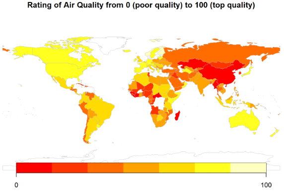

# INFO_201_Final_Project
AU23 Logan, Annie, and Aagney

```
This project is going to discuss the implications of global pollution and analyzing the potential influence of salary with pollutions. 
Global pollution is a continuous issue occurring significantly post-industrial revolution with greenhouse gases 
raising which affects all generations. Although pollution is a dense category, we hope to explore air 
and water pollution data globally throughout a large time frame. The target audience of this project are individuals or organizations 
concerned about the environmental pollution in different regions. Specifically, people who are interested in learning 
about the pollution disparity between different countries and regions can look to the findings of this project for information. 
For example, regional organizations focused on improving and advocating for more sustainability measures could use this information 
to support their cause, such as placing attainable goals based on comparing with data from similar regions.
```



